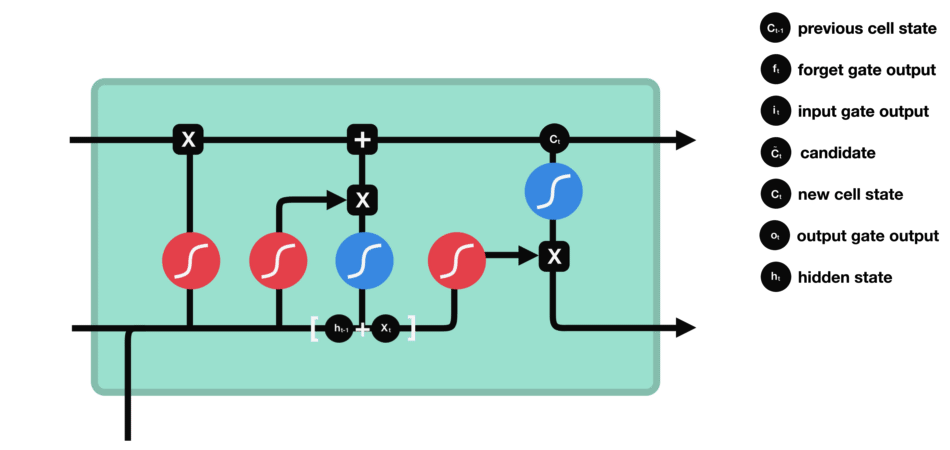

# Aggressive comment classifier 
Identify aggressive comments on youtube using LSTM model. 

### Dataset

We used Selenium and Beautiful Soup to crawl comments from youtube videos based on keywords. We manually graded each comment in to 3 scales: (1) normal (2) slightly aggressive (3) very aggressive. 

### Data pre-processing 

In order to train model on the collected dataset, we use the following steps to tokenize natural language into numerical vectors. 

### Model 

### Results 
